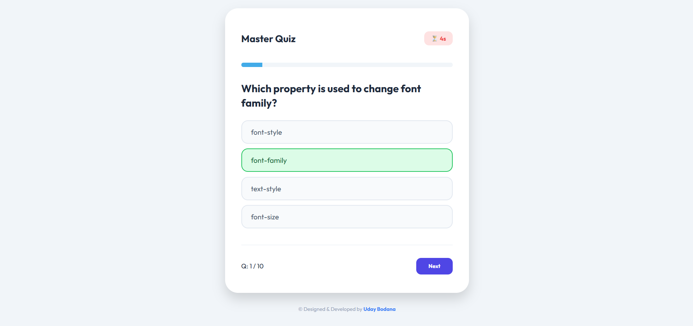

# 🎯 Master Quiz

An interactive multiple-choice quiz application designed to evaluate development and programming skills. Seamlessly tracks quiz progress, computes final scores, and provides immediate visual feedback.

---

## ✨ Features

- **Dynamic Questions:** Clean, real-time loading of technical questions and multiple-choice options.
- **Progress & Score Tracking:** Features a smooth progress indicator bar and real-time score counters.
- **Instant Visual Feedback:** Color-coded correct/incorrect styling answers instantly on option selection.
- **High Score Logging:** Includes an integrated mechanism to securely save and load high scores using `localStorage`.
- **Premium User Experience:** smooth hover effects, and distinct, modern typography.

---

## 🚀 How to Use

1. **Start Quiz:** Enter your name to begin the assessment journey.
2. **Answer Questions:** Carefully evaluate options and tap on your chosen response.
3. **Check Results:** Review visual correctness markers, complete all questions, and review your final percentage score.

---

## 💻 Tech Stack

- **HTML5**
- **CSS3**
- **JavaScript**

---

## 🏃 How to Run

1. Clone or download this repository.
2. Open `index.html` directly in any web browser, or use a local development server like **Live Server** in VS Code.

---

## 📸 Preview

---

© Designed & Developed by **Uday Bodana**